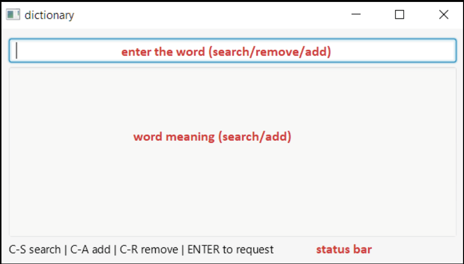

# Distributed Dictionary

## Description
This is a multi-threaded server implemented in a client-server architecture using Java language that allows concurrent clients to search the meaning(s) of a word, add a new word, and remove an existing word.

## Run
Start Server: java -jar DictionaryServer.jar <'PORT'> <DICT.txt>

Start Client: java -jar DictionaryClient.jar <'IP ADDRESS'> <'PORT'>

## GUI
